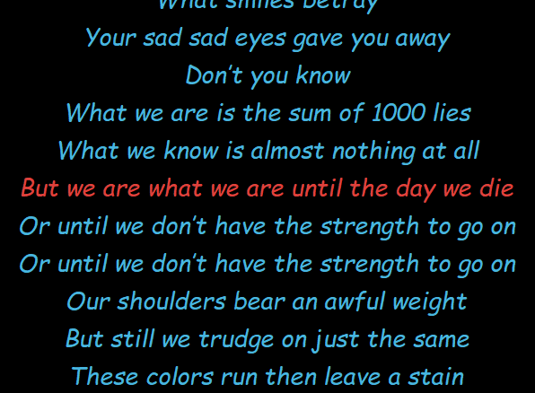
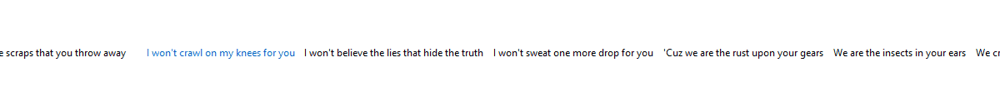
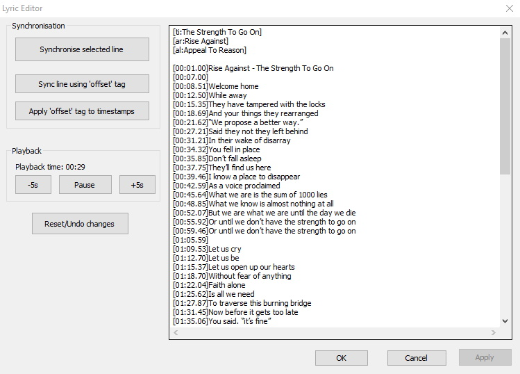

# foo_openlyrics

An open-source lyrics plugin for [foobar2000](https://www.foobar2000.org/) that includes its own UI panel for displaying and sources for downloading lyrics that are not available locally. It is intended to be a replacement for LyricShowPanel3 so it is fully-featured and supports lyric searching, saving and editing directly from within foobar2000.

## Features
* Buttery-smooth lyric scrolling (either horizontally or vertically)
* Supports retrieving lyrics from local files, ID3 tags or the internet
* Customise the font & colours to perfectly suite your layout & theme
* Easily edit lyrics directly inside foobar2000 with built-in support for timestamps
* Check the saved lyrics of any track in your library (whether it is currently playing or not)
* Apply common edits (such as removing blank lines) in just 2 clicks
* ...and more!

## Screenshots
Fonts & colours are fully configurable

Horizontal scrolling is also supported

The editor window

## How to install foo_openlyrics
1. Find the latest [release on Github](https://github.com/jacquesh/foo_openlyrics/releases).
2. Download the `fb2k-component` file attached to the release (don't worry about the `debug_symbols` zip file).
3. Double-click on the file you just downloaded. Assuming foobar2000 is installed, it should open up with the installation dialog. Restart foobar2000 when asked.
4. Add the "OpenLyrics Panel" to your layout.

## Why another lyrics plugin?
At the time that I started this, the most widely-used lyrics plugin was [foo_uie_lyrics3](https://www.foobar2000.org/components/view/foo_uie_lyrics3) which had several built-in sources but those had largely stopped working due to the relevant websites doing down or otherwise becoming generally unavailable. The original developer seemed to be nowhere in sight though and the source for the plugin did not appear to be available anywhere online. There is an SDK for building one's own sources for foo_uie_lyrics3 but building plugins for plugins didn't really take my fancy. Other (more up-to-date) plugins did exist but were mostly distributed by people posting binaries for you to download from their Dropbox on Reddit. Running binaries published via Dropbox by random people on Reddit did not seem like the most amazing idea.

## Contributing
Please do log an issue or send a pull request if you have found a bug, would like a feature added. If you'd like to support the project you can also [make a small donation](https://www.buymeacoffee.com/jacquesheunis).
