# OpenLyrics metrics run Q2 2023

## Introduction

Metrics were collected from 2023-04-10 to 2023-07-10. The goal was to find out specifically how many users make use of various bits of openlyrics, to inform where future development efforts should be directed.

A total of 3790 batches of metrics were submitted, however on release the metrics submission code had a bug that cause a crash (which in turn would prevent metrics from being submitted) and there were several hundred reports of that crash, so I conclude that there are at least around 4000 users with openlyrics installed. Possibly more, I have no way of knowing the number of users opted *not* to submit metrics, but I would guess that it is relatively low.

If we look at the distribution of metrics submissions in time, we see that it doesn't actually fall off *that* much over time, suggesting that people are either making fresh installs of openlyrics, or (more likely) are not updating particularly promptly when a new version is released.

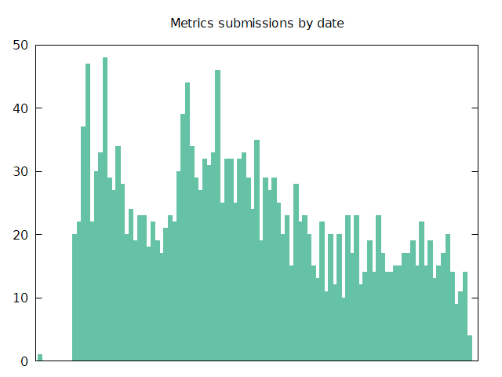

This also suggests that the actual number of users is somewhat higher and that we'd see that if I left the metrics collection running for longer.

## Lyrics panels on the UI

Of those that submitted, clearly not everybody actually uses it though, as can be seen from the number of panels people have on their UI:
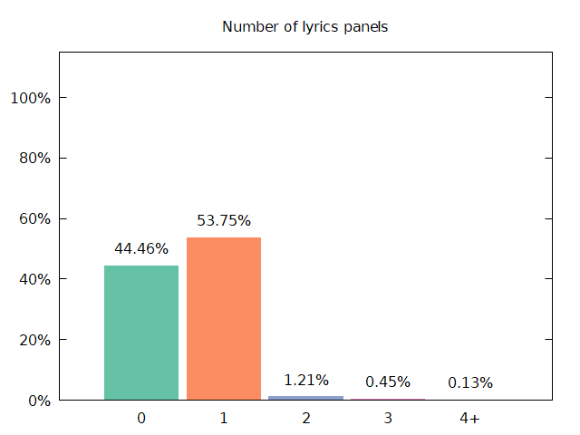

Only around 55% of users that submitted metrics for openlyrics have any openlyrics panels on their UI. I find this surprising but maybe people install the plugin, realise they don't want it or use it, and then forget about it without uninstalling it. For the remainder of the analysis, I have excluded users with no panels since that isn't a high-priority use-case, leaving only the 2105 users to consider. I don't know how (or why) some users have upwards of 4 panels (one user had 9!) but who am I to judge ¯\_(ツ)_/¯

## One (scroll) direction

With that in mind, let's take a look at the question that prompted me to add metrics in the first place: Does anybody actually use horizontal scrolling?

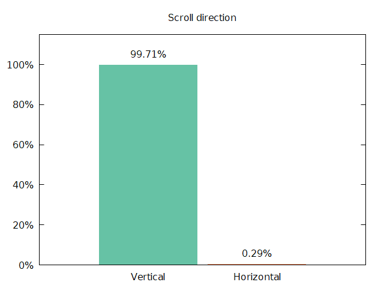

Not really. This is good for me, it means I can remove that feature (which has relatively high maintenance overhead) without feeling (too) bad about it. Sorry to the 0.29% of users that use it...but only a little bit sorry. I should not have added this feature to begin with.

## Efficient searching

The intended usage is that users select a save source (local files or metadata tags), always save lyrics retrieved from the internet, and then have that same source configured as the first search source (so that we'll always first check whatever they've saved locally before consulting the internet, thereby avoiding spamming lyric services with many unnecessary requests).

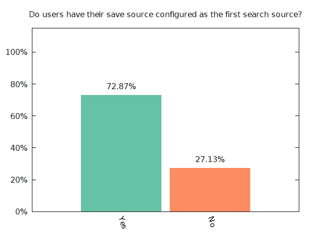

Except that this is not the case for a surprisingly large number of users. I do not understand why. In the long term I plan to enforce this because in addition to reducing traffic on lyric sources, it also significantly reduces the search latency when a new track starts playing (it's obviously much faster to search the local disk than to search the internet...which is just somebody else's "local disk").

While we're at it, which sources are people usually searching anyway?

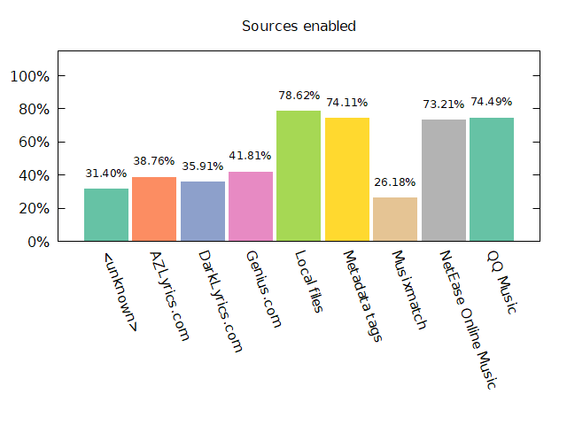

Unsurprisingly the sources that are enabled by default have way more users than those that are not. This is your regularly-scheduled reminder that defaults are important and powerful. To be completely honest, I don't know why we got so many "Unknown" entries in that list, it suggests that there is either a bug or that people have configuration that references a source that does not exist. That's very weird, I'll have to look into it.

## Versions

Stats about versions in-use are always interesting, but in this case they're also useful:

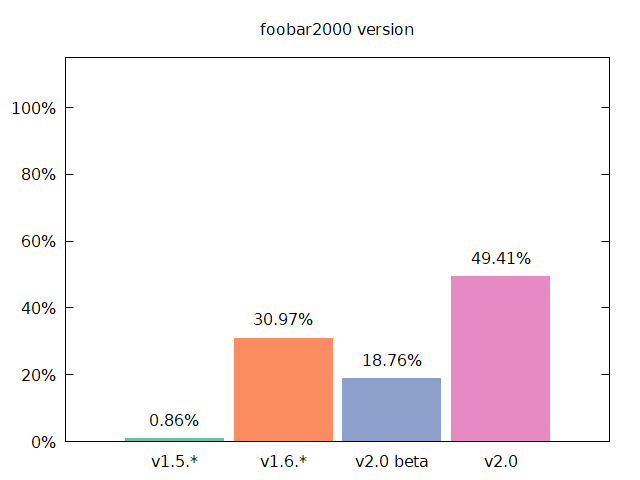

We currently list v1.5 as our minimum supported version, but very few users are actually using foobar2000 v1.5. That means we can bump the required version (and access new, more powerful functionality provided by fb2k in the process) without affecting many users. I was somewhat surprised by the number of users on v2.0 and I would actually expect that number to generally be increasing over time (v2.0 was released shortly after we began collecting metrics) and so it might even be reasonable to bump the required version to v2.0.
 
The version stats for openlyrics are less useful (since the metrics collection is tied to a version number) but we have it anyway so:

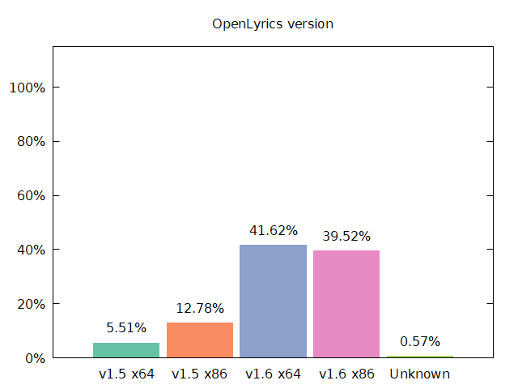

I think the interesting thing here is the split between x64 and x86 users, with x64 coming out just slightly ahead. Good to know.

## Miscellaneous
I won't provide any commentary but for completeness the remainder of the graphs I produced are below:

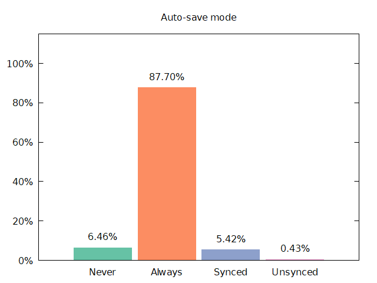
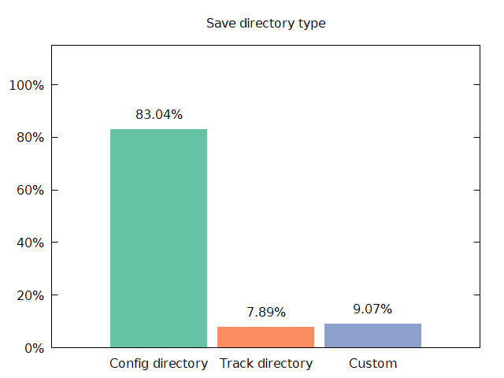
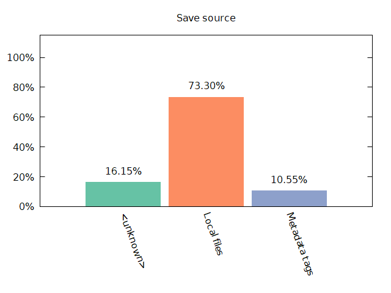
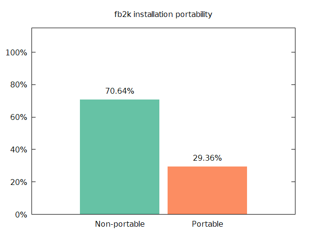
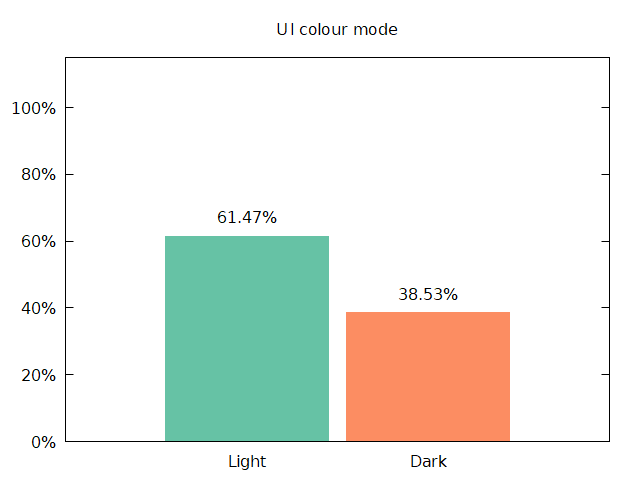
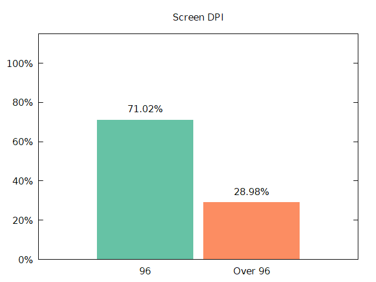
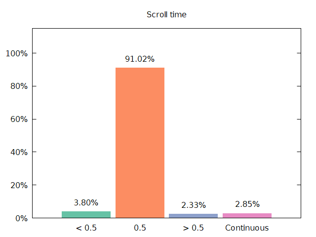
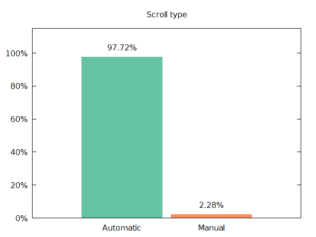
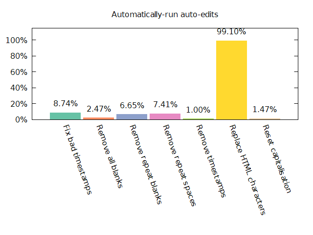
